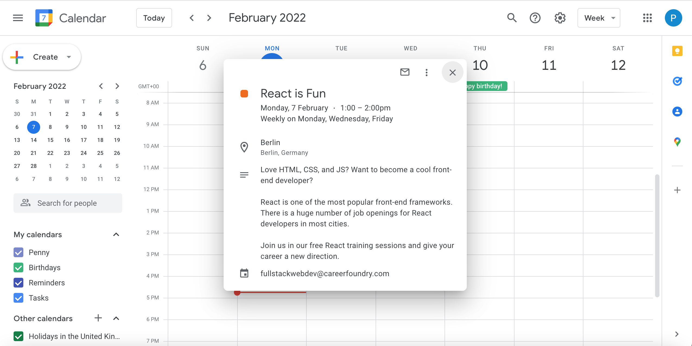

# Meet app

 

Meet app is a serverless, progressive web application built using React, that uses the Google Calendar API to provide information about upcoming educational events for full-stack developers. 

Users can filter events by location, expand events to see detailed event descriptions, and view summary information about the event subject areas and the number of events by location, using charts.

The objectives of this project were:
  - To build a simple react app using a test-driven development approach; and
  - To implement a remote authentication server that uses the OAuth2.0 protocol to authenticate users and authorize their requests to the Google Calendar API using their Google credentials.

Further details about the testing performed can be found in the Testing section below. 

An overview of the server implementation is provided in the Installation and Set up section.

Please note that as this project was built for educational purposes, the events themselves are fictitious. 

## Live website

Visit Meet app [here](https://penny167.github.io/meet/)

## Key features

- Meet app displays a list of upcoming developer events, showing for each event: the title, date, time, location and a contact email. A "Show details" button toggles a full event description and a link to the details on the user's Google calendar (illustrated above).
- By default, 12 events are displayed spanning all locations. However, users can search for specific event locations and specify the number of events that they wish to see displayed, by typing their selections in to input boxes located above the events list. 
- A progress bar appears whilst the page updates to reflect user selections.
- Alerts are displayed to notify the user if a location requested does not exist, if the requested number of events exceeds the events available for the location specified, and if the requested number of events exceeds the maximum number that the page can display. 
- In addition to the events, the app displays two charts implemented using Recharts: a pie chart showing the events summarised by subject area, and a scatter chart showing the number of events by location. The charts update when the user selects a location of interest and/or changes the number of events that they wish to see displayed.
- Meet app is progressive and can be used offline where it will display events cached during the most recent visit. An alert indicates to the user when they are working offline.
- The app is responsive and adjusts automatically to fit the screen size available.
- The app uses OAuth2.0 to implement efficient user authentication and authorization. On visiting the welcome page, users simply sign in with Google and provide consent to access their Google calendar. This completes the authorization process and takes users directly to the main page displaying the events. This process is implemented serverlessly using AWS Lambda to provide the backend. 

## Technologies

- React
- Jest
- Enzyme
- jest-cucumber
- Puppeteer
- Serverless
- Googleapis
- Axios
- Atatus
- nprogress
- Recharts
- gh-pages

## Testing

- A set of features, user stories and scenarios was created up front as the basis for the development of the app components. These are contained in the features files that reside within the features directory, with one file per feature. 
- The test runner Jest was used to perform unit and integration tests on the components. The files for these tests are located inside the tests directory. Acceptance testing was performed using jest-cucumber. The acceptance testing files are located inside the features directory alongside the features files. One feature was also tested end-to-end using Puppeteer and this file is located in the tests directory.
- The package Enzyme was used to facilitate shallow and full rendering of components for test purposes. Enzyme requires an adapter to be compatible with React v17 and this is imported and configured within the setupTests.js file.  
- Create-react-app incorporates the test runner Jest by default. The other testing packages were installed using NPM and are included in the package.json file as dev dependencies.
- Note that testing focused solely on the core functionality of the app as described in the features files and summarised in the first two Key Features described above.

To run the test files use the command: 
```
npm run test
```

## Installation and Set up

This project requires Node.js to be installed. The documentation can be found [here](https://nodejs.org/en/).

To install Meet app, in the root project directory run: 
```
npm install
```
Navigate to the auth-server directory and run the command again. This will install the modules required by the auth-server specifically.

At this stage you will have the Meet app files and node modules required to build the project components. However, in order to run the app using data from the Google Calendar API, you will need to complete the following additional steps: 
1) Set up your project on Github and use github pages to provide a live website URL for your app
2) Register your app with Google to obtain OAuth credentials
3) Set up an authorisation server with AWS Lambda and deploy the serverless functions
4) Replace existing code references to the website and credentials with those specific to your project
<br>
The detailed instructions for these steps are as follows:
<br>

**1) Setting up the project and generating a URL**<br>
Create a github repository for your project. This will allow you to use github pages to create the live website that will host the app and interact with the authorisation server. Your github pages URL will be: https://YOUR_GITHUB_USERNAME.github.io/YOUR_REPOSITORY_NAME
- Replace the homepage URL in the package.json file with your github pages URL. 
- In the auth-server directory handler.js file, update the credentials object properties: redirect_uris and javascript_origins. 
- In the WelcomeScreen.jsx file, update the href for the privacy policy. 
- Initialize git in the project directory, add your repository URL and push the changes.
The gh-pages package is already installed and configured to publish your app to the live website when the project is deployed.
<br>

**2) Registering the app with Google**<br>
To implement OAuth2.0 and access the Google Calendar API, you must first register your app with Google to provide your site's details and obtain the credentials that are required during the authorisation process:
- Navigate to the [Google developers console](https://console.developers.google.com). Click Create project, name your project, click Create. Select Enable APIs and Services, search for and select the Google Calendar API, Enable it.
- Now you need to set up credentials. Click create credentials and select the following options: Google Calendar API, Called from a web browser using JavaScript, Accessing user data, External users. Click create.
- Next complete the OAuth consent screen where you will provide your contact details as the developer responsible for the app. Add yourself as a test user. Then complete the Scopes section: select ../auth/calendar.readonly. Click Update then Save and continue.
- Now create your OAuth client ID: complete the fields specifying Web app and your app name. For authorized JavaScript origins end the domain from your github pages site URL. For the Authorized redirect URIs use the full github pages URL (this mirrors the changes you made to the handler.js file above so everything is now pointing to your own github pages website for your app). Click Create. Your credentials will now be available to download and will always be available on the credentials page of your google console.
- Finally, inside the auth-server directory, create a config.json file. Inside the file, create the following object, replacing the values with the credentials you obtained from Google and your project ID (you will find the project ID on your Google dashboard): 
{
  "CLIENT_ID": "YOUR_GOOGLE_CLIENT_ID",
  "PROJECT_ID": "YOUR_GOOGLE_PROJECT_ID",
  "CLIENT_SECRET": "YOUR_GOOGLE_CLIENT_SECRET",
  "CALENDAR_ID": "fullstackwebdev@careerfoundry.com"
}
<br>

**3) Setting up the authorisation server**<br>


The framework Serverless is used to deploy the functions that handle the authentication and authorization requests to the remote server. The functions themselves are created using Google APIs to access the Google calendar API and authenticate users using Google credentials. 

AWS provides an access key ID and secret key that are required to configure Serverless to deploy functions directly to AWS. They can be obtained via the AWS management console.


Published on github pages

## Author
Github: [@penny167](https://github.com/Penny167)
